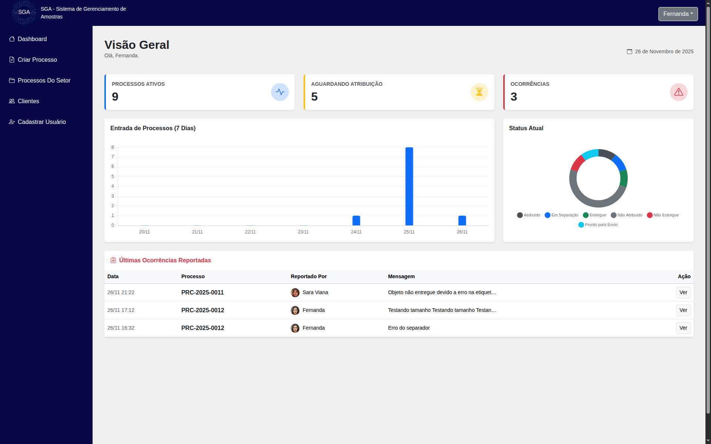
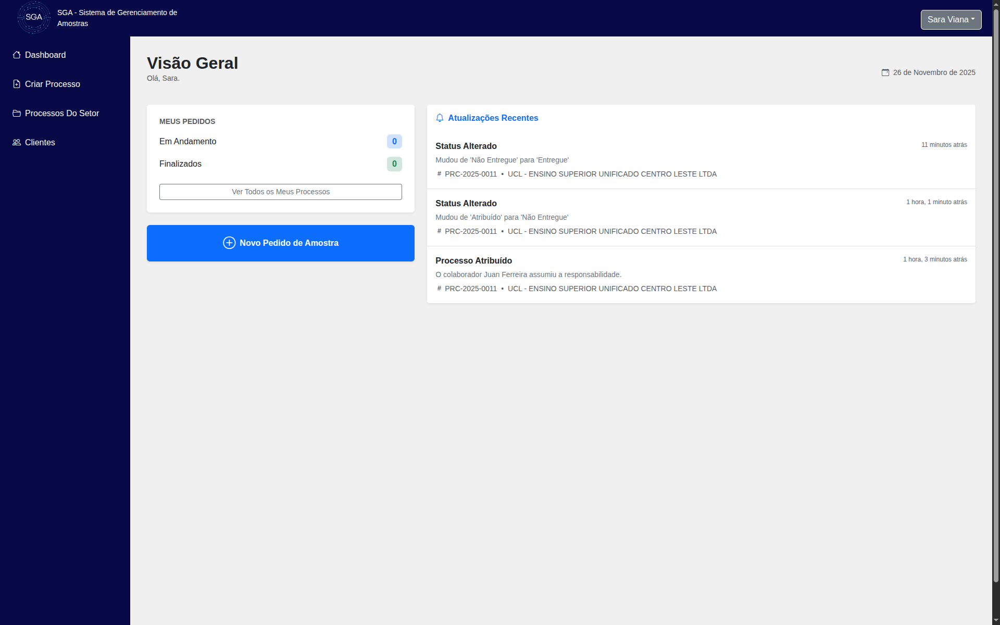
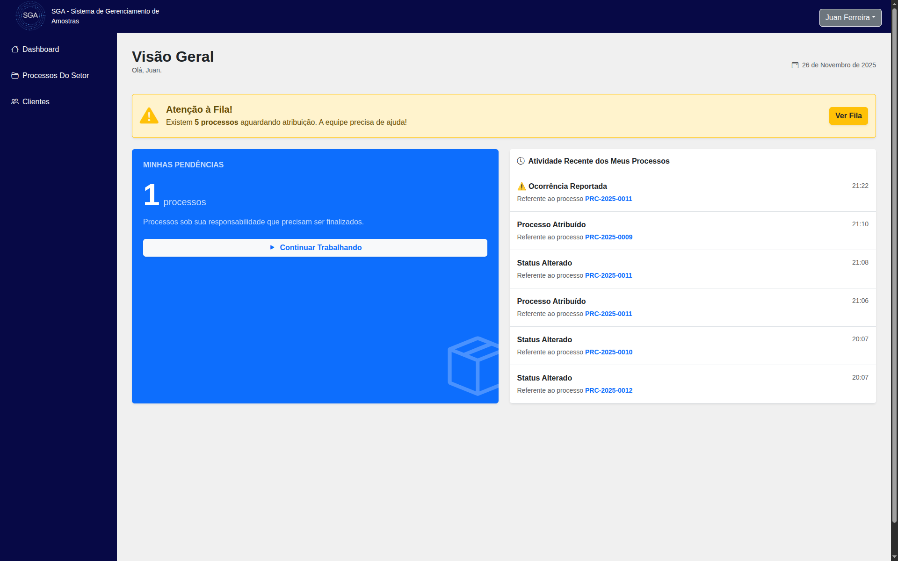
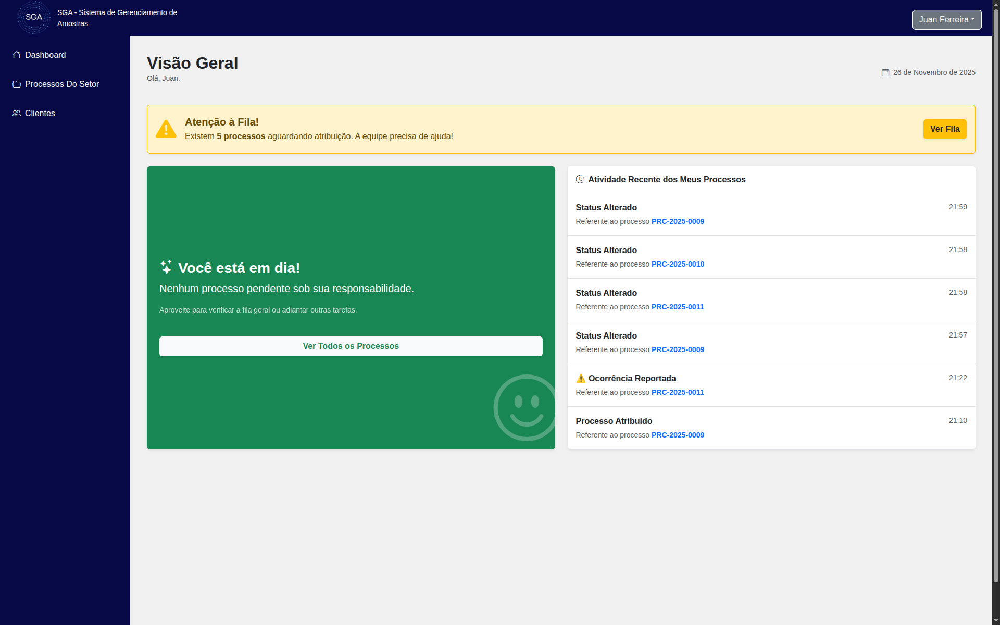
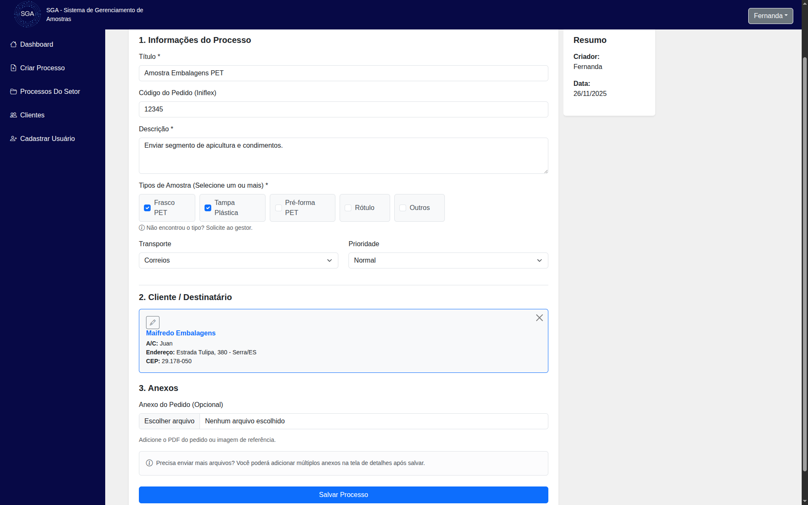
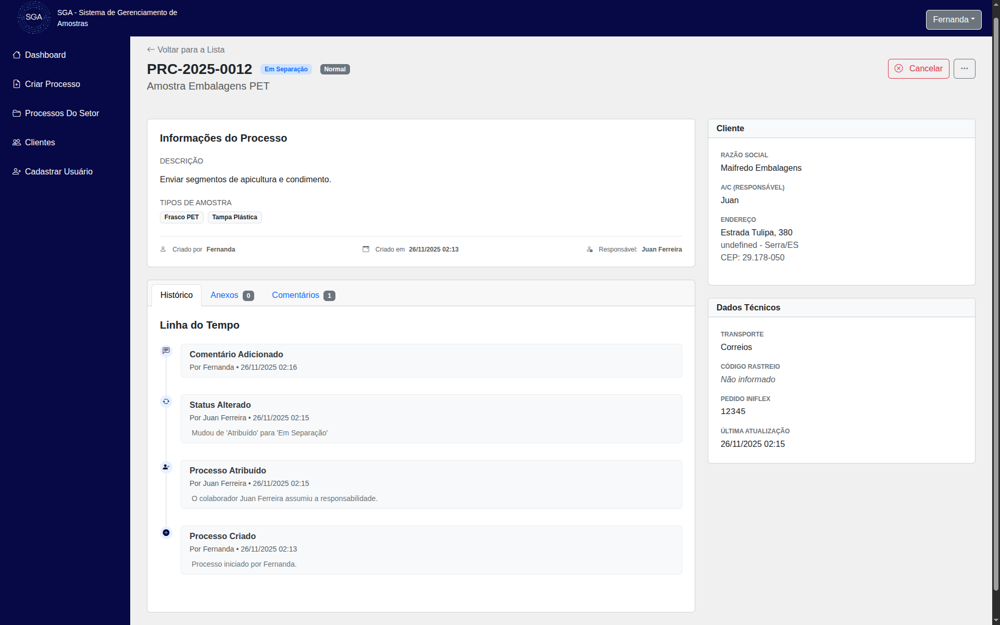
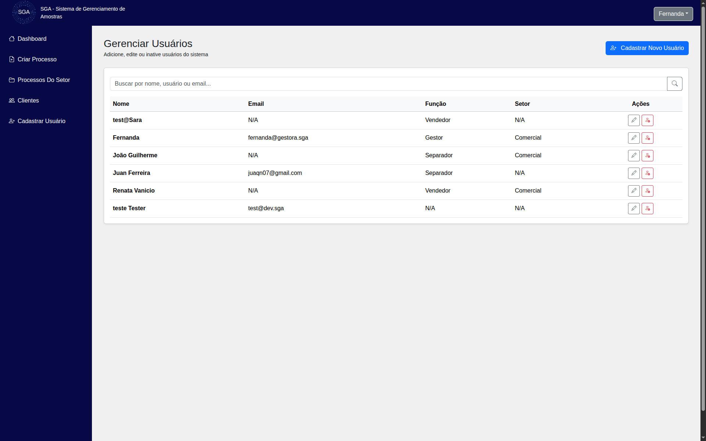

<div align="center">
  
  <h1>SGA - Sistema de Gerenciamento de Amostras</h1>
  
  <p>
    <b>Otimização, Rastreabilidade e Controle para Processos Industriais</b>
  </p>

  <p>
    
    
    
    
  </p>
</div>

---

## 📖 Sobre o Projeto

O **SGA** é uma solução web robusta desenvolvida para modernizar o fluxo de separação e análise de amostras industriais. O sistema substitui controles manuais e planilhas por um fluxo de trabalho digital, auditável e seguro.

Focado na experiência do usuário e na integridade dos dados, o SGA implementa conceitos de **"Pull System"** (auto-atribuição de tarefas), **Auditoria em Tempo Real** (Timeline) e **Hierarquia de Permissões**.

> Projeto desenvolvido como parte do Projeto Integrador do Curso Técnico em Informática do IFES.

---

## 🖥️ Visão Geral do Sistema

### 📊 Dashboards Personalizados
Visão centralizada dos indicadores de desempenho, com contadores de status e gráficos de produtividade semanal.


*(Visão do Gestor com indicadores e gráficos)*


*(Visão do Vendedor com última movimentação dos processos)*


*(Visão do Separador com processos pendentes)*


*(Visão do Separador com processos todos encerrados)*

---

## ✨ Principais Funcionalidades

### 1. Gestão de Processos (Core)
O coração do sistema, focado em agilidade e rastreabilidade.

* **Criação Inteligente:** Formulário de criação com busca de clientes via **AJAX** (estilo Correios/E-commerce) e cadastro rápido via Modal, sem sair da tela. Suporte a múltiplos tipos de amostra e upload de anexo inicial.
* **Listagem Avançada:** Filtros dinâmicos por busca textual, status e prioridade. Paginação inteligente e separação visual para Gestores ("Meus Processos" vs "Todos").
* **Fluxo de Atribuição:** Implementação de **Auto-atribuição**. Separadores visualizam a fila "Não Atribuída" e puxam a responsabilidade para si.


*(Interface de criação com busca AJAX e Modais)*

### 2. Rastreabilidade e Detalhes
Cada processo possui uma **Timeline** imutável que registra automaticamente:
* Criação e Atribuição.
* Mudanças de Status e definição de Rastreio.
* Alterações críticas em dados do Cliente (Auditoria).
* Uploads de anexos e registro de ocorrências.


*(Timeline detalhada e gestão de anexos)*

### 3. Módulo Administrativo (`accounts`)
* **Controle de Acesso (RBAC):** Três níveis de permissão distintos:
    * **Gestor:** Acesso total, CRUD de usuários, cancelamento de processos.
    * **Vendedor:** Criação de pedidos, visualização restrita aos seus processos.
    * **Separador:** Operação logística, alteração de status, inserção de rastreio.
* **Segurança:** Implementação de **Soft Delete** (Inativação) para preservar histórico de usuários demitidos/removidos.


*(Gestão de usuários com Soft-Delete)*

---

## 🛠️ Tecnologias Utilizadas

* **Backend:** Python 3, Django 5 (MVT Architecture)
* **Frontend:** HTML5, CSS3 (Custom + Bootstrap 5), JavaScript (Vanilla + Fetch API)
* **Banco de Dados:** SQLite3 (Dev) / MySQL (Prod - *Planejado*)
* **Bibliotecas Chave:**
    * `Pillow`: Processamento de imagens de perfil.
    * `Chart.js`: Visualização de dados no dashboard.
* **Ferramentas:** Git, GitHub, VS Code.

---

## 🚀 Instalação e Execução

Siga os passos abaixo para rodar o projeto localmente.

### Pré-requisitos
* Python 3.10+
* Git

### Passo a Passo

1.  **Clone o repositório:**
    ```bash
    git clone [https://github.com/Juaqn07/sga-sistema-de-gerenciamento-de-amostras.git](https://github.com/Juaqn07/sga-sistema-de-gerenciamento-de-amostras.git)
    cd sga-sistema-de-gerenciamento-de-amostras/sga
    ```

2.  **Crie e ative o ambiente virtual:**
    ```bash
    python -m venv venv
    # Windows
    .\venv\Scripts\activate
    # Linux/Mac
    source venv/bin/activate
    ```

3.  **Instale as dependências:**
    ```bash
    pip install -r requirements.txt
    ```

4.  **Configure o Banco de Dados:**
    ```bash
    python manage.py migrate
    ```

5.  **Crie um Superusuário (Gestor):**
    ```bash
    python manage.py createsuperuser
    ```

6.  **Execute o servidor:**
    ```bash
    python manage.py runserver
    ```
    Acesse: `http://127.0.0.1:8000/admin` e crie os primeiros usuários

---

## 👥 Equipe

| Nome | Função |
| :--- | :--- |
| **Diego de Souza Gonoring** | Front-End / Prototipagem|
| **Julia Soares Moreira** | Front-End / Prototipagem|
| **Juan Ferreira dos Santos** | Back-End / Arquitetura |
| **Evelin Santos de Jesus** | Documentação |

---

## ⚖️ Licença

Este é um software proprietário desenvolvido para fins acadêmicos e comerciais.
Todos os direitos reservados © 2025 - Equipe SGA.