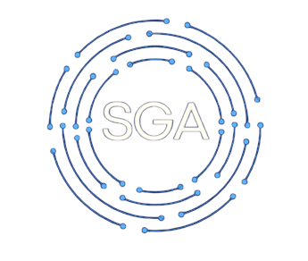

# SGA - Sistema de Gerenciamento de Amostras

**Status:** 🚧 Em Desenvolvimento (Projeto Integrador) 🚧

O **SGA** é um sistema web desenvolvido para otimizar os processos e melhorar a comunicação entre os setores envolvidos na separação e análise de amostras industriais, garantindo mais agilidade, organização e rastreabilidade nas operações.

Este projeto foi desenvolvido como parte do Projeto Integrador do Curso Técnico em Informática do IFES.

---

## 🎯 Funcionalidades Principais

O sistema foi projetado de acordo com os requisitos do Termo de Abertura, incluindo um robusto controle de acesso baseado em funções:

### 🔐 Controle de Acesso por Função
- **Gestor:** Acesso total; único autorizado a cadastrar usuários. Possui visão global dos processos.
- **Vendedor:** Pode criar novos processos e visualizar apenas seus próprios pedidos.
- **Separador:** Visualiza processos atribuídos e pode alterar o status das amostras.

### 📦 Gestão de Processos
- Criação de novos processos/pedidos de amostra.
- Listagem e filtragem avançada por cliente, lote, data e status.
- Dashboard com indicadores visuais e informações em tempo real.

### 🔎 Rastreabilidade e Ocorrências
- Acompanhamento completo do status das amostras.
- Registro de ocorrências (problemas, perdas, atrasos).

---

## 🛠️ Tecnologias Utilizadas

O projeto utiliza um stack moderno baseado em Python e Django.

- **Backend:** Python 3, Django  
- **Frontend:** HTML5, CSS3, JavaScript  
- **Framework CSS:** Bootstrap 5  
- **Banco de Dados (Desenvolvimento):** SQLite3  
- **Banco de Dados (Produção):** MySQL  
- **Bibliotecas Python:** `Django`, `Pillow`  
- **Ferramentas:** Git, GitHub, Trello, Figma  

---

## 🚀 Como Executar o Projeto

Siga os passos abaixo para configurar o ambiente local.

### ✔️ Pré-requisitos
- Python **3.10+**
- Git

---

### 1. Clonar o Repositório

```bash
git clone https://github.com/Juaqn07/sga-sistema-de-gerenciamento-de-amostras.git
cd sga-sistema-de-gerenciamento-de-amostras/sga
```

---

### 2. Criar e Ativar o Ambiente Virtual

```bash
# Criar o venv
python -m venv venv

# Ativar (Linux/Mac)
source venv/bin/activate

# Ativar (Windows PowerShell)
.\venv\Scripts\Activate.ps1
```

---

### 3. Instalar as Dependências

Certifique-se de que o arquivo `requirements.txt` está no projeto.

```bash
pip install -r requirements.txt
```

---

### 4. Configurar o Banco de Dados

Gera o arquivo `db.sqlite3` e aplica as migrações:

```bash
python manage.py migrate
```

---

### 5. Criar um Superusuário (Gestor)

```bash
python manage.py createsuperuser
```

Siga as instruções para configurar **username**, **email** e **password**.

---

### 6. (Opcional) Criar Usuários de Teste

1. Execute o servidor:

   ```bash
   python manage.py runserver
   ```
2. Acesse o admin: `http://127.0.0.1:8000/admin/`
3. Faça login com o superusuário.
4. Edite seu usuário e defina a **Função: Gestor**.
5. Crie usuários adicionais como:

   * `vendedor_teste`
   * `separador_teste`

---

### 7. Executar o Servidor

```bash
python manage.py runserver
```

Acesse o sistema:
➡️ `http://127.0.0.1:8000/`

---

## 👥 Equipe do Projeto

* **Diego de Souza Gonoring** — Líder do Projeto / Desenvolvedor Front-End
* **Evelin Santos de Jesus** — Documentadora
* **Juan Ferreira dos Santos** — Desenvolvedor Back-End
* **Julia Soares Moreira** — Desenvolvedora Front-End

---

## ⚖️ Licença

Este é um software proprietário. Todos os direitos são reservados.

© 2025 — Equipe SGA (Diego, Evelin, Juan, Julia).